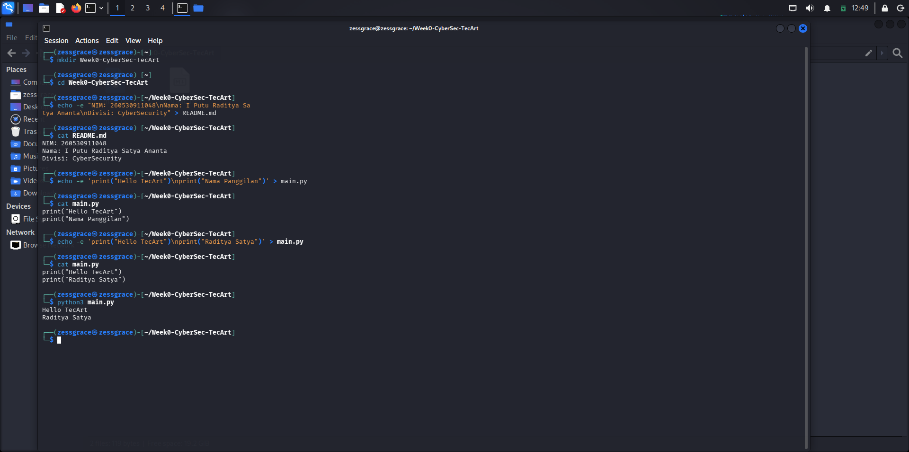
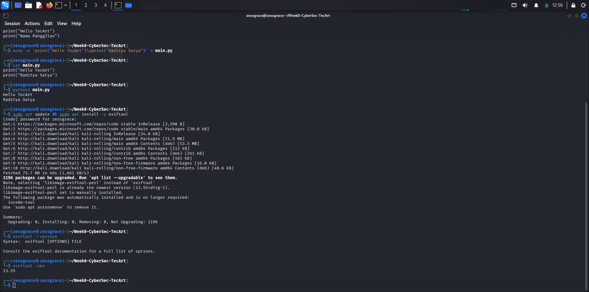
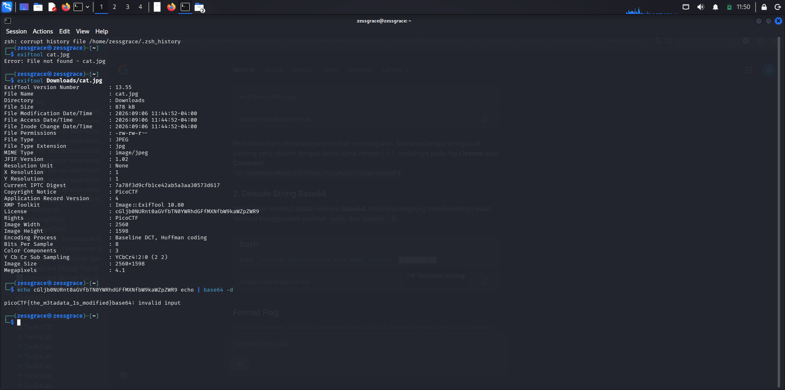

NIM: 260530911048
Nama: I Putu Raditya Satya Ananta
Divisi: CyberSecurity
Kategori CTF: Forensics
Tools yang berhasil di instal: Exiftool,Kali Linux,Python
Dokumentasi Py : 
Dokumentasi penginstalan Exiftools melalui terminal: 
Penyelesaian schallenge “information”.https://learn.cylabacademy.org/library/186 ( Forensics )
langkah 1: Buka/click link yang sudah diberikan
langkah 2: Identifikasi jenis soal
langkah 3: Download file yang sudah di sediakan soal
langkah 4: Identifikasi file yang sudah di download
langkah 5: buka terminal
langkah 6: gunakan command exiftool "folderpenyimpanfile/namafile.jpg", lalu enter
Penjelasan: ExifTool adalah aplikasi berbasis command-line (baris perintah) gratis dan open-source yang digunakan untuk membaca, menulis, dan mengedit metadata pada berbagai macam file, terutama file gambar, foto, audio, dan video
Dokumentasi hasil pengerjaan: 
Referensi: pengerjaan website kak sanca.
